# iQOO Hackathon 2026 - AgentKit Submission Draft

This document contains the prepared copy for your hackathon submission. You can copy and paste the values directly into the registration form.

---

## 1. Team Android Dev Proficiency
**Select:** `expert` (or `intermediate` depending on your team's background. Suggesting `expert` or `intermediate` signals high capability).

## 2. Team LLM Proficiency
**Select:** `Local LLM deployed on-device`
> [!TIP]
> This is crucial because the judging criteria explicitly weight **on-device LLM execution** and **on-device intelligence**. Selecting this aligns your team perfectly with the evaluation rubric.

---

## 3. Your Idea *
**Field description:** *In a few lines, explain what you want to build at the hackathon. Problem, approach, why it matters.*
**Character count:** ~1,450 characters (Limit: 2000 characters, min 20)

### Copy-Paste Content:
```text
Problem:
Students struggle with information overload across lectures, syllabi, and assignment deadlines. Existing solutions rely on cloud LLMs, which raise privacy/IP concerns for proprietary university coursework, require expensive subscriptions, and fail in classrooms with poor cellular connection. 

Approach:
We are building "Aura: On-Device Academic Co-Pilot"—a privacy-first, context-aware autonomous agent for students. Aura runs entirely on-device utilizing Android AICore (Gemini Nano) or Llama 3.2-3B via MediaPipe. 
1. Real-time Lecture Intelligence: Transcribes and extracts actionable items (deadlines, concepts) locally.
2. Contextual Scheduling: Integrates with device calendar & location to suggest optimal micro-study sessions based on class schedule.
3. Hybrid Processing Engine: Under the "First Hybrid Model", the phone acts as the user's primary interface (voice capture, local chat, context). During "Green Light" windows, the phone bridges via iQOO Office Kit to the laptop, which serves as the high-throughput worker (generating vector indexes for heavy textbooks, PDF parsing) and syncs back.

Why it matters:
Aura gives students a zero-latency, offline-first study companion that secures their data. It transforms the phone from a distraction into an intelligent coordinator that learns their schedule and helps them excel, without dependency on expensive cloud APIs.
```

---

## 4. Why is this different? *
**Field description:** *What makes this different from existing solutions? Your edge approach, phone-first angle, or insight.*
**Character count:** ~520 characters (Limit: 600 characters, min 10)

### Copy-Paste Content:
```text
Unlike cloud tools (ChatGPT/NotebookLM) that require constant internet and upload private files, Aura executes locally. Our edge is the hybrid architecture: the smartphone manages real-time, low-power sensing (microphone transcriptions, location, schedules), while the laptop (bridged via iQOO Office Kit) acts as the offline computing engine for heavy document vectorization. This creates a seamless, context-rich loop where student data never leaves their local network.
```

---

## 5. Presentation / Architecture *
Here is the recommended architecture diagram and slides structure for your PPT/PDF upload.

### Suggested PDF/PPT Slides Structure:
1. **Title Slide**: Aura - The Privacy-First On-Device Academic Co-Pilot.
2. **The Problem**: Classroom offline reality, cloud cost, privacy of student files.
3. **The Solution (Aura)**: Low-latency local LLM + Hybrid coordination.
4. **Architecture Diagram**: (See Mermaid layout below).
5. **On-Device Tech Stack**: Android AICore/Gemini Nano, MediaPipe LLM Inference API, Room Database.
6. **Hybrid Bridging (iQOO Office Kit)**: Red Light vs. Green Light workflow description.

### Technical Architecture Flow:

```mermaid
graph TD
    subgraph Mobile Interface [iQOO Flagship Device]
        UI[Aura Flutter/Native App] -->|Captures| Mic[Live Audio/Speech-to-Text]
        UI -->|Reads| Calendar[Calendar & System Context]
        UI -->|Queries| LocalLLM[On-Device LLM: Gemini Nano / Llama 3.2]
        LocalLLM -->|Retrieves| LocalDB[Room DB: Tasks & Summaries]
    end

    subgraph Laptop Muscle [Development Laptop]
        LaptopLLM[Heavy Embedding & Extraction] -->|Indexes| LargePDFs[Textbooks & Academic Papers]
        VectorDB[Local Vector Database: Chroma/FAISS] -->|Stores| Embeddings[Knowledge Embeddings]
    end

    %% Bridging
    UI <==>|iQOO Office Kit Bridge| LaptopLLM
    LocalDB <==>|Sync Embeddings & Summaries| VectorDB

    style Mobile Interface fill:#1a1b26,stroke:#f7768e,stroke-width:2px;
    style Laptop Muscle fill:#1a1b26,stroke:#7aa2f7,stroke-width:2px;
```


